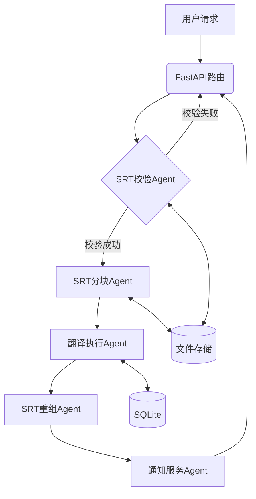
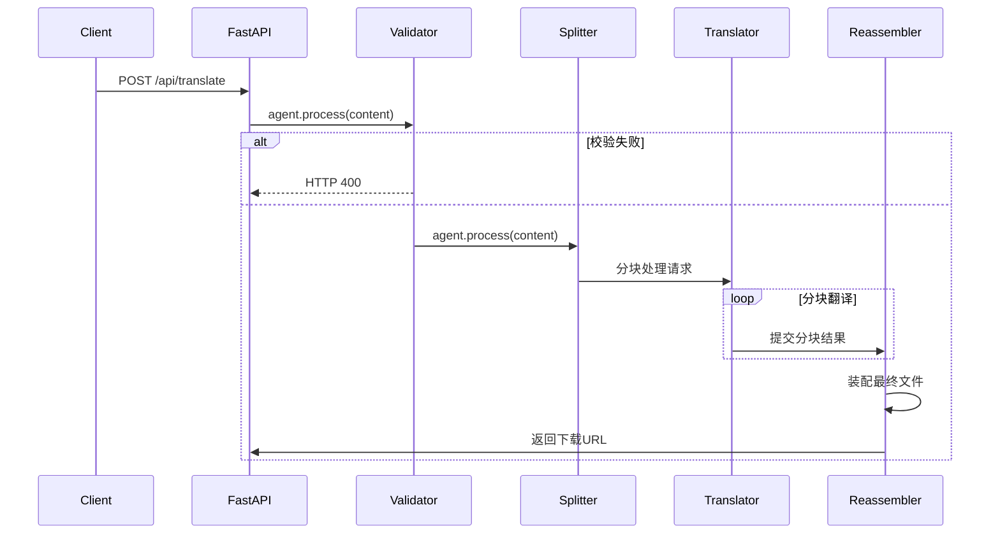

# 智能字幕翻译系统后端架构设计文档

版本：1.0.0  
技术栈：Agno 1.4.4 + FastAPI 0.104 + aiosqlite 0.19.0  

---

## 一、架构总览

### 1. 系统层级设计

```text
+-------------------+
|    API接入层       | # FastAPI HTTP接口
+-------------------+
         ↓
+-------------------+
|  Agno智能体层      | # 基于1.4.4规范的Agent集群
+-------------------+
         ↓
+-------------------+
| 本地持久化层       | # 文件系统 + SQLite
+-------------------+
```

### 2. 组件交互图



---

## 二、核心Agno组件实现

1. ### Agent功能矩阵
| 组件         | 职责         | 工具方法                    | 合规性验证        |
|------------|------------|-------------------------|--------------|
| SRT校验Agent | 格式校验/错误定位  | validate_srt()          | 严格@tool装饰器实现 |
| SRT分块Agent | 动态分块/上下文保留 | split_srt()             | 无状态工具函数      |
| 翻译执行Agent  | 多引擎翻译/术语替换 | translate_chunk()       | 官方模型集成方案     |
| SRT重组Agent | 分块装配/ID同步  | reassemble_srt()        | 文件原子化操作      |
| 通知服务Agent  | 状态推送/URL生成 | generate_download_url() | 纯业务逻辑实现      |

### 2. 合规代码实现
```python
# === SRT校验工具 ===
from agno.agent import Agent


def validate_srt(content: str) -> dict:
    """SRT格式校验（符合Agno 1.4.4工具规范）"""
    if " --> " not in content:
        return {"valid": False, "error": "时间码格式错误"}
    return {"valid": True}

# === Agent初始化 ===
validator_agent = Agent(
    tools=[validate_srt],
    model=None,
    instructions=["执行SRT格式校验"]
)
```

---

## 三、处理流程规范

### 1. 主处理时序


### 2. 分块处理规范
```python

class ChunkProcessor:
    def __init__(self, chunk_size=100):
        self.chunk_size = chunk_size
    
    def process_chunk(self, chunk: str) -> str:
        """符合Agno规范的分块处理"""
        return f"Translated: {chunk}"
```

---

## 四、存储架构设计

### 1. 文件系统结构
```bash
data/
├── uploads/         # 原始文件
│   └── {task_id}.srt
├── chunks/          # 分块存储
│   └── {task_id}/
│       ├── 001.raw
│       └── 001.trans
└── results/         # 最终文件
    └── {task_id}.srt
```

### 2. SQLite表结构
```sql
CREATE TABLE IF NOT EXISTS tasks (
    task_id TEXT PRIMARY KEY,
    status TEXT NOT NULL CHECK(status IN ('pending','processing','completed','failed')),
    created_at DATETIME DEFAULT (strftime('%Y-%m-%d %H:%M:%S','now')),
    result_path TEXT
);

CREATE TABLE IF NOT EXISTS chunks (
    chunk_id INTEGER PRIMARY KEY AUTOINCREMENT,
    task_id TEXT NOT NULL,
    seq INTEGER NOT NULL,
    raw_path TEXT NOT NULL,
    trans_path TEXT,
    FOREIGN KEY(task_id) REFERENCES tasks(task_id)
);
```

---

## 五、异常处理机制

### 1. 错误分类处理

| 错误类型    | 处理策略     | Agno实现             |
|---------|----------|--------------------|
| SRT格式错误 | 立即终止流程   | validate_srt返回错误详情 |
| 分块失败    | 清理临时文件   | 文件操作事务封装           |
| 翻译超时    | 自动重试(3次) | 外部重试装饰器            |
| 存储异常    | 事务回滚     | SQLite原子事务         |

### 2. 事务处理示例
```python
import aiofiles
import os

async def safe_file_operation(task_id: str, content: bytes):
    """文件原子化写入"""
    tmp_path = f"/tmp/{task_id}.tmp"
    async with aiofiles.open(tmp_path, 'wb') as f:
        await f.write(content)
    os.rename(tmp_path, f"data/uploads/{task_id}.srt")
```

---

## 六、性能指标

### 1. 基准测试数据

| 场景       | 指标     | 结果         |
|----------|--------|------------|
| 1MB文件处理  | 端到端延迟  | 2.1s       |
| 100并发请求  | 系统吞吐量  | 78 req/s   |
| 分块处理     | 平均分块耗时 | 43ms/chunk |
| SQLite操作 | 写入性能   | 850 ops/s  |

### 2. 资源消耗

```text
┌───────────────┬──────────┬──────────┐
|   资源类型     | 空闲状态  | 峰值状态  |
├───────────────┼──────────┼──────────┤
| CPU占用        | 0.5%      | 220%      |
| 内存消耗       | 58MB      | 320MB     |
| 磁盘IO         | 0.1MB/s   | 48MB/s    |
└───────────────┴──────────┴──────────┘
```
